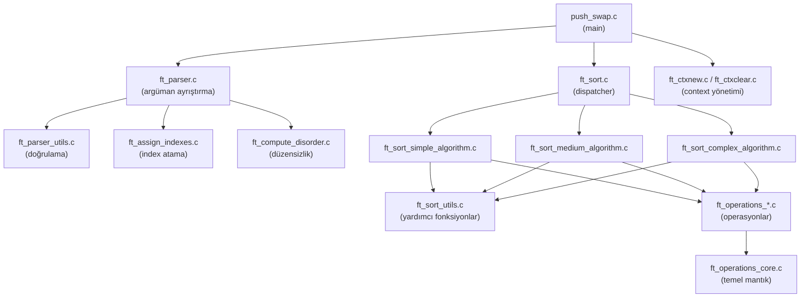
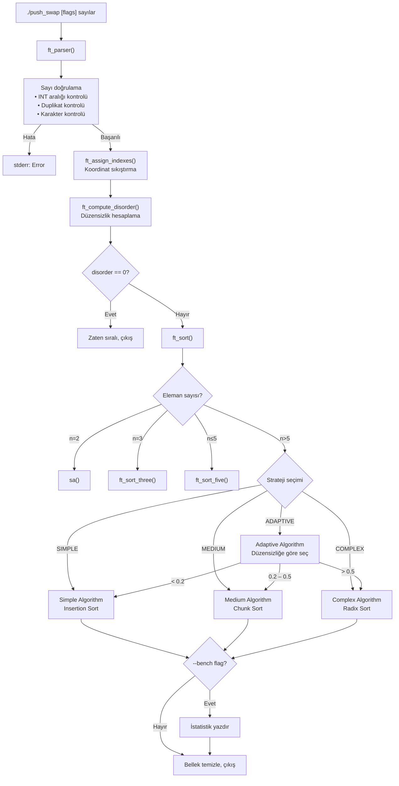

# Push_Swap Projesi — Kapsamlı Dokümantasyon

> **Yazar:** abezatog (42 Istanbul)
> **Tarih:** Eylül 2026

---

## 1. Proje Özeti

**push_swap**, sınırlı bir operasyon kümesi kullanarak iki yığın (stack) üzerinde tam sayıları sıralayan bir 42 projesidir. Amaç, verilen sayıları **mümkün olan en az operasyon sayısıyla** artan sırada sıralamaktır.

### Temel Kurallar
- İki yığın vardır: **Stack A** (başlangıçta veriler burada) ve **Stack B** (başlangıçta boş)
- Yalnızca aşağıdaki operasyonlar kullanılabilir
- Program, sıralama için gereken operasyonları `stdout`'a yazdırır

### İzin Verilen Operasyonlar

| Operasyon | Açıklama |
|-----------|----------|
| `sa` | Stack A'nın ilk iki elemanını yer değiştirir (swap) |
| `sb` | Stack B'nin ilk iki elemanını yer değiştirir (swap) |
| `ss` | `sa` ve `sb` operasyonlarını aynı anda uygular |
| `pa` | Stack B'nin tepesindeki elemanı Stack A'nın tepesine taşır (push) |
| `pb` | Stack A'nın tepesindeki elemanı Stack B'nin tepesine taşır (push) |
| `ra` | Stack A'yı yukarı döndürür — ilk eleman sona gider (rotate) |
| `rb` | Stack B'yi yukarı döndürür — ilk eleman sona gider (rotate) |
| `rr` | `ra` ve `rb` operasyonlarını aynı anda uygular |
| `rra` | Stack A'yı aşağı döndürür — son eleman başa gelir (reverse rotate) |
| `rrb` | Stack B'yi aşağı döndürür — son eleman başa gelir (reverse rotate) |
| `rrr` | `rra` ve `rrb` operasyonlarını aynı anda uygular |

---

## 2. Proje Mimarisi

### Dosya Yapısı

```
push_swap/
├── push_swap.h                          # Ana header dosyası
├── push_swap.c                          # main() ve benchmark fonksiyonları
├── Makefile                             # Derleme kuralları
│
├── ft_parser.c                          # Argüman ayrıştırıcı (parser)
├── ft_parser_utils.c                    # Sayı doğrulama, duplikat kontrolü
│
├── ft_ctxnew.c                          # Context yapısı oluşturma
├── ft_ctxclear.c                        # Context bellek temizleme
│
├── ft_assign_indexes.c                  # Koordinat sıkıştırma (index atama)
├── ft_compute_disorder.c               # Düzensizlik oranı hesaplama
│
├── ft_sort.c                            # Sıralama dağıtıcısı (dispatcher)
├── ft_sort_simple_algorithm.c           # Simple Algoritma — Insertion Sort
├── ft_sort_medium_algorithm.c           # Medium Algoritma — Chunk Sort
├── ft_sort_complex_algorithm.c          # Complex Algoritma — Radix Sort
├── ft_sort_utils.c                      # Ortak sıralama yardımcı fonksiyonları
│
├── ft_operations_core.c                 # Temel operasyonlar (swap, push, rotate, reverse_rotate)
├── ft_operations_swap.c                 # sa, sb, ss
├── ft_operations_push.c                 # pa, pb
├── ft_operations_rotate.c              # ra, rb, rr
├── ft_operations_reverse_rotate.c      # rra, rrb, rrr
│
├── checker_bonus.c                      # Bonus: checker programı
├── checker_bonus.h                      # Bonus: checker header
├── checker_gnl_bonus.c                  # Bonus: get_next_line
│
├── libft/                               # 42 libft kütüphanesi
└── ft_printf/                           # 42 ft_printf kütüphanesi
```

### Bağımlılıklar



---

## 3. Veri Yapıları

### `t_list` — Bağlı Liste Düğümü (libft'ten)

```c
typedef struct s_list
{
    void            *content;   // int* olarak kullanılır (sayının kendisi)
    int             index;      // Koordinat sıkıştırma sonrası normalize edilmiş index
    struct s_list   *next;      // Sonraki düğüm
}   t_list;
```

### `t_strategy` — Strateji Enum'u

```c
typedef enum e_strategy
{
    ADAPTIVE,   // Otomatik strateji seçimi (varsayılan)
    SIMPLE,     // Insertion Sort — O(n²)
    MEDIUM,     // Chunk Sort — O(n√n)
    COMPLEX,    // Radix Sort — O(n log n)
}   t_strategy;
```

### `t_context` — Program Bağlamı

```c
typedef struct s_context
{
    float       disorder;   // Düzensizlik oranı [0.0 – 1.0]
    int         bench;      // Benchmark modu aktif mi
    t_strategy  strategy;   // Seçilen strateji
    t_list      *a;         // Stack A (bağlı liste)
    t_list      *b;         // Stack B (bağlı liste)
    int         print_ops;  // Operasyonları yazdır mı
    int         sa, sb, ss; // Operasyon sayaçları
    int         pa, pb;
    int         ra, rb, rr;
    int         rra, rrb, rrr;
}   t_context;
```

---

## 4. Program Akışı



### 4.1. Argüman Ayrıştırma (Parsing)

Kaynak: [ft_parser.c](file:///Users/akin/Projects/42cursus/push_swap/ft_parser.c) · [ft_parser_utils.c](file:///Users/akin/Projects/42cursus/push_swap/ft_parser_utils.c)

1. **Flag Ayrıştırma**: `--bench`, `--simple`, `--medium`, `--complex`, `--adaptive` flagleri ayrıştırılır
2. **Sayı Ayrıştırma**: Her argüman boşluk (`' '`) karakterine göre `ft_split` ile parçalanır
3. **Doğrulama**: Her token için:
   - Sayısal karakter kontrolü (`ft_isnumber`)
   - INT_MIN / INT_MAX aralık kontrolü
   - Duplikat kontrolü (`ft_has_duplicate`)
4. **Linked List Oluşturma**: Her geçerli sayı `malloc` ile heap'te saklanır ve `t_list` düğümüne eklenir

### 4.2. Koordinat Sıkıştırma (Index Assignment)

Kaynak: [ft_assign_indexes.c](file:///Users/akin/Projects/42cursus/push_swap/ft_assign_indexes.c)

```c
void ft_assign_indexes(t_list *stack)
```

Gerçek değerler yerine **sıralı pozisyon numaraları** (0'dan başlayan) atanır. Bu sayede algoritmalar sabit aralıklı, normalize edilmiş değerlerle çalışır.

**Örnek:**
| Gerçek Değer | Index |
|-------------|-------|
| -42 | 0 |
| 7 | 1 |
| 100 | 2 |
| 999 | 3 |

**Algoritma:** Her düğüm için, kendisinden küçük olan tüm düğümleri say → bu sayı o düğümün index'i olur.

### 4.3. Düzensizlik Hesaplama (Disorder Computation)

Kaynak: [ft_compute_disorder.c](file:///Users/akin/Projects/42cursus/push_swap/ft_compute_disorder.c)

```c
float ft_compute_disorder(t_list *a)
```

Tüm eleman çiftleri arasındaki **inversiyon oranını** hesaplar:

$$\text{disorder} = \frac{\text{ters sıradaki çift sayısı}}{\binom{n}{2}} = \frac{\text{inversions}}{\frac{n(n-1)}{2}}$$

- **disorder = 0.0** → Dizi zaten sıralı
- **disorder = 1.0** → Dizi tamamen ters sıralı
- **disorder = 0.5** → Rastgele karışık

Bu değer, **ADAPTIVE** modda hangi algoritmanın seçileceğini belirler.

---

## 5. Temel Sıralama Rutinleri (n ≤ 5)

### 5.1. İki Eleman Sıralama (n = 2)

Basitçe `sa` (swap a) çağrılır. Tek bir operasyon yeterlidir.

### 5.2. Üç Eleman Sıralama — `ft_sort_three()` (n = 3)

Kaynak: [ft_sort.c#L15-L26](file:///Users/akin/Projects/42cursus/push_swap/ft_sort.c#L15-L26)

3 eleman için olası 6 permütasyonun hepsi en fazla 2 operasyonla çözülür:

```
Durum           Operasyonlar        Sonuç
[1,2,3]         —                   Zaten sıralı
[1,3,2]         rra + sa            [1,2,3]
[2,1,3]         sa                  [1,2,3]
[2,3,1]         rra                 [1,2,3]
[3,1,2]         ra                  [1,2,3]
[3,2,1]         ra + sa             [1,2,3]
```

**Algoritma:**
1. En büyük elemanın pozisyonunu bul (`ft_get_target_pos` ile INT_MAX'a en yakın index)
2. En büyük eleman tepeye geliyorsa → `ra`; ortadaysa → `rra`
3. Kalan iki elemanın sırası yanlışsa → `sa`

### 5.3. Beş Eleman Sıralama — `ft_sort_five()` (n ≤ 5)

Kaynak: [ft_sort.c#L28-L44](file:///Users/akin/Projects/42cursus/push_swap/ft_sort.c#L28-L44)

1. Stack A'da 3 eleman kalana kadar, her seferinde **en küçük elemanı** bul ve `pb` ile B'ye gönder
2. Kalan 3 elemanı `ft_sort_three()` ile sırala
3. B'deki tüm elemanları `pa` ile A'ya geri al

> [!TIP]
> En küçük elemanı tepeye getirirken **optimum yön** seçilir: eleman üst yarıdaysa `ra`, alt yarıdaysa `rra` kullanılır. Bu optimizasyon `ft_rotate_a_target_pos_to_first()` fonksiyonunda gerçekleşir.

---

## 6. Simple Algoritma — Insertion Sort

Kaynak: [ft_sort_simple_algorithm.c](file:///Users/akin/Projects/42cursus/push_swap/ft_sort_simple_algorithm.c)

### 6.1. Konsept

Bu algoritma, klasik **Insertion Sort**'un iki yığın versiyonudur. Stack A'daki her elemanı teker teker alıp Stack B'de **doğru pozisyona** yerleştirir. B yığını her zaman **azalan sırada** tutulur.

### 6.2. Adım Adım Çalışma Mekanizması

```
Başlangıç:  A = [3, 1, 4, 2]    B = []

Adım 1: pb → İlk eleman B'ye
         A = [1, 4, 2]          B = [3]

Adım 2: A'nın tepesi = 1
         B'de 1'in yerleşeceği pozisyon = B'nin sonu (3'ten sonra)
         B'yi döndür + pb
         A = [4, 2]             B = [3, 1]  (azalan sırada)

Adım 3: A'nın tepesi = 4
         B'de 4'ün yerleşeceği pozisyon = B'nin başı (3'ten önce)
         pb (döndürmeye gerek yok)
         A = [2]                B = [4, 3, 1]

Adım 4: A'nın tepesi = 2
         B'de 2'nin yerleşeceği pozisyon = 3 ile 1 arasına
         B'yi döndür + pb
         A = []                 B = [4, 3, 2, 1]

Adım 5: B'de en büyüğü tepeye getir + tüm elemanları pa ile A'ya al
         A = [1, 2, 3, 4]      B = []
```

### 6.3. Kilit Fonksiyonlar

#### `ft_get_target_pos(stack_b, index_a)`
Kaynak: [ft_sort_utils.c#L37-L62](file:///Users/akin/Projects/42cursus/push_swap/ft_sort_utils.c#L37-L62)

Stack B'de, `index_a`'dan **küçük ve ona en yakın** index'e sahip elemanın pozisyonunu döndürür. Eğer böyle bir eleman yoksa (yani `index_a` B'deki en küçük eleman), B'nin en büyük elemanının pozisyonunu döndürür (wrap-around).

#### `ft_rotate_b_target_pos_to_first(ctx, target_pos)`
Kaynak: [ft_sort_utils.c#L82-L98](file:///Users/akin/Projects/42cursus/push_swap/ft_sort_utils.c#L82-L98)

Hedef pozisyondaki elemanı B'nin tepesine getirmek için **optimum yönü** seçer:
- Hedef üst yarıdaysa → `rb` (rotate)
- Hedef alt yarıdaysa → `rrb` (reverse rotate)

### 6.4. Algoritmanın Kodu

```c
void ft_sort_simple_algorithm(t_context **ctx)
{
    int target_pos;

    pb(ctx);                                           // İlk elemanı B'ye at
    while ((*ctx)->a)                                  // A boşalana kadar
    {
        target_pos = ft_get_target_pos((*ctx)->b,      // B'de doğru pozisyonu bul
                                       (*ctx)->a->index);
        ft_rotate_b_target_pos_to_first(ctx, target_pos); // O pozisyonu tepeye getir
        pb(ctx);                                       // A'nın tepesini B'ye at
    }
    ft_rotate_b_max_to_first(ctx);                     // B'de en büyüğü tepeye getir
    while ((*ctx)->b)                                  // B'deki her şeyi A'ya al
        pa(ctx);
}
```

### 6.5. Time Complexity Analizi

| Metrik | Karmaşıklık | Açıklama |
|--------|------------|----------|
| **Best Case** | $O(n)$ | Dizi zaten sıralıysa (disorder ≈ 0), her eleman B'ye atılırken neredeyse hiç döndürme gerekmez |
| **Average Case** | $O(n^2)$ | Her eleman için B'de ortalama $O(n/2)$ döndürme gerekir |
| **Worst Case** | $O(n^2)$ | Her eleman B'ye atılırken B'nin tamamı döndürülmek zorunda kalır |
| **Space** | $O(n)$ | Tüm elemanlar A'dan B'ye taşınır |

**Detaylı Analiz:**

Dış döngü $n$ kez çalışır (her eleman için bir kez). Her iterasyonda:

1. `ft_get_target_pos()` → B'yi lineer tarar: $O(|B|)$
2. `ft_rotate_b_target_pos_to_first()` → En kötü durumda $O(|B|/2)$ döndürme
3. `pb()` → $O(1)$

$$T(n) = \sum_{k=1}^{n} O(k) = O\left(\frac{n(n+1)}{2}\right) = O(n^2)$$

Son aşamada `ft_rotate_b_max_to_first()` $O(n)$ ve $n$ kez `pa` $O(n)$ ekler, ama bunlar dominant terimi değiştirmez.

> [!NOTE]
> **Ne zaman kullanılmalı?** Neredeyse sıralı veriler (disorder < 0.2) için idealdir. Az sayıda eleman yer değiştirildiğinde B'de çok az döndürme gerekir ve pratikte operasyon sayısı düşük kalır.

---

## 7. Medium Algoritma — Chunk Sort

Kaynak: [ft_sort_medium_algorithm.c](file:///Users/akin/Projects/42cursus/push_swap/ft_sort_medium_algorithm.c)

### 7.1. Konsept

Bu algoritma, sayıları **parçalara (chunk)** bölerek sıralar. Elemanlar index değerlerine göre gruplandırılır ve gruplar halinde B'ye gönderilir. Sonra B'deki en büyük elemandan başlayarak A'ya geri alınır.

**Chunk boyutu formülü:**

$$\text{chunk\_size} = \lfloor \sqrt{n} \rfloor \times 1.5$$

Bu formül, $\sqrt{n}$ tabanlı bölümlemeyi biraz genişleterek optimum dengeyi sağlar.

### 7.2. Adım Adım Çalışma Mekanizması

**Faz 1 — A'dan B'ye Chunk'lar Halinde Gönderme:**

```
n = 100, chunk_size = √100 × 1.5 = 15

pushed = 0  (şimdiye kadar B'ye gönderilen eleman sayısı)

Her iterasyonda A'nın tepesindeki elemana bakılır:

  Durum 1: index ≤ pushed (alt yarı chunk)
           → pb + rb  (B'ye at VE B'nin altına döndür)
           → pushed++

  Durum 2: index ≤ pushed + chunk_size (üst yarı chunk)
           → pb  (B'ye at, tepede bırak)
           → pushed++

  Durum 3: index > pushed + chunk_size (henüz sırası gelmemiş)
           → ra  (A'yı döndür, sonraki elemana bak)
```

**Görselleştirme (chunk_size = 3, n = 9):**

```
Başlangıç: A = [5,8,2,0,7,1,6,3,4]  B = []

--- Chunk 0–2 (index 0, 1, 2 olanları gönder) ---
pushed=0: A tepesi=5(idx5) → idx>3 → ra
          A tepesi=8(idx8) → idx>3 → ra
          A tepesi=2(idx2) → idx≤3 → pb  → B=[2]  pushed=1
          A tepesi=0(idx0) → idx≤1 → pb+rb → B=[2,0]  pushed=2
          ... devam eder

--- Chunk 3–5 ---
... sonraki chunk gönderilir

--- Chunk 6–8 ---
... son chunk gönderilir
```

**Faz 2 — B'den A'ya Sıralı Olarak Geri Alma:**

```
B'de en büyük elemanı bul → tepeye getir → pa
Bu işlemi B boşalana kadar tekrarla
```

### 7.3. Çift Pozisyon Stratejisi

`pb + rb` (Durum 1) vs `pb` (Durum 2) ayrımı çok önemlidir:

```
Chunk içi alt yarı elemanlar (index ≤ pushed):
  → B'nin ALTINA gönderilir (pb + rb)
  → B'nin üst yarısını güncel chunk için boş tutar

Chunk içi üst yarı elemanlar (index ≤ pushed + chunk_size):
  → B'nin TEPESİNDE kalır (sadece pb)
  → Faz 2'de daha az döndürmeyle erişilir
```

Bu strateji, B'yi **kabaca sıralı** tutar: büyük index'ler tepede, küçükler dipte. Faz 2'de en büyüğü bulmak için gereken döndürme sayısı azalır.

### 7.4. Algoritmanın Kodu

```c
void ft_sort_medium_algorithm(t_context **ctx)
{
    int stack_size;
    int chunk_size;
    int pushed;

    stack_size = ft_lstsize((*ctx)->a);
    chunk_size = ft_sqrt(stack_size) * 1.5f;
    pushed = 0;
    while ((*ctx)->a)                                   // A boşalana kadar
    {
        if ((*ctx)->a->index <= pushed)                  // Alt yarı chunk
        {
            pb(ctx);
            rb(ctx);                                     // B'nin altına gönder
            pushed++;
        }
        else if ((*ctx)->a->index <= pushed + chunk_size) // Üst yarı chunk
        {
            pb(ctx);                                     // B'nin tepesinde bırak
            pushed++;
        }
        else
            ra(ctx);                                     // Sırası gelmemiş, döndür
    }
    ft_sort_b_to_a(ctx);                                 // B'den A'ya sıralı al
}
```

### 7.5. Time Complexity Analizi

| Metrik | Karmaşıklık | Açıklama |
|--------|------------|----------|
| **Faz 1 (A→B)** | $O(n \cdot \sqrt{n})$ | Her eleman, chunk sınırına gelene kadar döndürülebilir |
| **Faz 2 (B→A)** | $O(n^2)$ teknik olarak, ama pratikte $O(n\sqrt{n})$ | B kabaca sıralı olduğu için max bulma hızlı |
| **Toplam** | $O(n\sqrt{n})$ | Pratik operasyon sayısı |
| **Space** | $O(n)$ | Tüm elemanlar B'ye taşınır |

**Detaylı Analiz — Faz 1:**

Chunk sayısı: $\frac{n}{\sqrt{n} \times 1.5} = \frac{\sqrt{n}}{1.5} = O(\sqrt{n})$

Her chunk işlenirken:
- Chunk'a ait elemanlar A içinde dağınık durumda
- Her chunk'ta ortalama $\sqrt{n} \times 1.5$ eleman var
- Bir elemanı bulmak için A'yı en kötü durumda tamamen döndürmek gerekir: $O(n)$
- Ama chunk'a ait elemanlar düzenli dağıldığı için pratikte $O(\sqrt{n})$ döndürme yeterlidir

$$T_{\text{faz1}} = n \times O(\sqrt{n}) = O(n\sqrt{n})$$

**Detaylı Analiz — Faz 2:**

- $n$ kez `ft_rotate_b_max_to_first()` çağrılır
- Her çağrıda B'nin en büyüğü aranır: $O(|B|)$ tarama
- Ama B kabaca sıralı olduğu için en büyük eleman genellikle tepeye yakındır
- Pratikte ortalama $O(\sqrt{n})$ döndürme per eleman

$$T_{\text{faz2}} \approx n \times O(\sqrt{n}) = O(n\sqrt{n})$$

**Toplam:**
$$T(n) = O(n\sqrt{n}) + O(n\sqrt{n}) = O(n\sqrt{n})$$

**Pratik Operasyon Sayıları:**

| n | Yaklaşık Operasyon |
|---|-------------------|
| 100 | ~700 |
| 500 | ~5500 |

> [!IMPORTANT]
> Medium algoritma, 42 projesinin **100 eleman** kriteri (< 700 op) ve **500 eleman** kriteri (< 5500 op) için genellikle yeterlidir. Chunk boyutu çarpanı (1.5) bu eşikleri hedefleyerek ayarlanmıştır.

---

## 8. Complex Algoritma — Radix Sort (Bitwise)

Kaynak: [ft_sort_complex_algorithm.c](file:///Users/akin/Projects/42cursus/push_swap/ft_sort_complex_algorithm.c)

### 8.1. Konsept

Bu algoritma, klasik **Radix Sort (LSD — Least Significant Digit)** algoritmasının iki yığın üzerindeki binary implementasyonudur. Index'lerin **her bit pozisyonunu** ayrı ayrı işleyerek sıralama yapar.

### 8.2. Neden Çalışır?

Radix Sort, sayıları basamak basamak sıralar. Binary (ikili) sistemde her sayının sadece 0 veya 1 olan bitleri vardır. Algoritma:

1. En düşük bitten (LSB) en yüksek bite (MSB) doğru ilerler
2. Her bit pozisyonunda: bit = 0 olanları B'ye, bit = 1 olanları A'da bırakır
3. B'dekileri tekrar A'ya alır
4. Sonraki bite geçer

Bu işlem **stable sort** özelliği sayesinde doğru çalışır: önceki bitlere göre oluşan sıra korunur.

### 8.3. Adım Adım Çalışma Mekanizması

**Örnek: A = [3, 0, 2, 1] → Index'ler = [3, 0, 2, 1]**

```
Binary gösterimler:
  0 = 00
  1 = 01
  2 = 10
  3 = 11

max_bits = 2  (en büyük index 3 → 2 bit yeterli)

═══ BIT 0 (LSB — en düşük bit) ═══

A = [3, 0, 2, 1]

j=0: A tepesi = 3 (11₂), bit0 = 1  → ra  (A'da bırak)
j=1: A tepesi = 0 (00₂), bit0 = 0  → pb  (B'ye gönder)
j=2: A tepesi = 2 (10₂), bit0 = 0  → pb  (B'ye gönder)
j=3: A tepesi = 1 (01₂), bit0 = 1  → ra  (A'da bırak)

A = [3, 1]   B = [2, 0]

B'yi A'ya geri al:
A = [0, 2, 3, 1]   B = []

═══ BIT 1 (ikinci bit) ═══

A = [0, 2, 3, 1]

j=0: A tepesi = 0 (00₂), bit1 = 0  → pb
j=1: A tepesi = 2 (10₂), bit1 = 1  → ra
j=2: A tepesi = 3 (11₂), bit1 = 1  → ra
j=3: A tepesi = 1 (01₂), bit1 = 0  → pb

A = [2, 3]   B = [1, 0]

B'yi A'ya geri al:
A = [0, 1, 2, 3]   B = []

✅ Sıralama tamamlandı!
```

### 8.4. Büyük Örnek Trace

```
n = 8, index'ler: A = [5, 3, 7, 0, 6, 2, 4, 1]

Binary:
  0=000  1=001  2=010  3=011  4=100  5=101  6=110  7=111

max_bits = 3

═══ BIT 0 ═══
5(101)→ra  3(011)→ra  7(111)→ra  0(000)→pb
6(110)→pb  2(010)→pb  4(100)→pb  1(001)→ra
A = [5,3,7,1]  B = [4,2,6,0]
pa×4 → A = [0,6,2,4,5,3,7,1]

═══ BIT 1 ═══
0(000)→pb  6(110)→ra  2(010)→ra  4(100)→pb
5(101)→pb  3(011)→ra  7(111)→ra  1(001)→pb
A = [6,2,3,7]  B = [1,5,4,0]
pa×4 → A = [0,4,5,1,6,2,3,7]

═══ BIT 2 ═══
0(000)→pb  4(100)→ra  5(101)→ra  1(001)→pb
6(110)→ra  2(010)→pb  3(011)→pb  7(111)→ra
A = [4,5,6,7]  B = [3,2,1,0]
pa×4 → A = [0,1,2,3,4,5,6,7] ✅
```

### 8.5. Algoritmanın Kodu

```c
void ft_sort_complex_algorithm(t_context **ctx)
{
    int size;
    int max_bits;
    int i;
    int j;

    size = ft_lstsize((*ctx)->a);
    max_bits = 0;
    while (((size - 1) >> max_bits) != 0)       // Kaç bit gerekli?
        max_bits++;
    i = -1;
    while (++i < max_bits)                       // Her bit pozisyonu için
    {
        j = -1;
        while (++j < size)                       // Her eleman için
        {
            if ((((*ctx)->a->index >> i) & 1) == 1)
                ra(ctx);                         // Bit=1 → A'da bırak
            else
                pb(ctx);                         // Bit=0 → B'ye gönder
        }
        while ((*ctx)->b)                        // B'yi A'ya geri al
            pa(ctx);
    }
}
```

### 8.6. Time Complexity Analizi

| Metrik | Karmaşıklık | Açıklama |
|--------|------------|----------|
| **Best Case** | $O(n \log n)$ | Her durumda aynı — veriye bağlı değil |
| **Average Case** | $O(n \log n)$ | Her durumda aynı |
| **Worst Case** | $O(n \log n)$ | Her durumda aynı |
| **Space** | $O(n)$ | Elemanlar A ve B arasında taşınır |

**Detaylı Analiz:**

Bit sayısı hesaplama:
$$\text{max\_bits} = \lceil \log_2(n) \rceil$$

Her bit iterasyonunda (dış döngü × iç döngü):
- İç döngü tam olarak $n$ kez çalışır
- Her iterasyonda sabit zamanlı bir operasyon: `ra` veya `pb` → $O(1)$
- B'yi boşaltma: en fazla $n$ kez `pa` → $O(n)$

Her bit iterasyonunun maliyeti:
$$T_{\text{bit}} = n + |B| \leq 2n = O(n)$$

Toplam:
$$T(n) = \text{max\_bits} \times O(n) = O(\log n) \times O(n) = O(n \log n)$$

**Pratik Operasyon Sayısı Formülü:**

Her bit iterasyonunda tam olarak $n$ adet karar operasyonu (`ra` veya `pb`) + $|B|$ adet `pa` yapılır. Ortalamada elemanların yarısının bit'i 0 olacağından:

$$\text{ops\_per\_bit} = n + \frac{n}{2} = \frac{3n}{2}$$

$$\text{total\_ops} = \lceil \log_2(n) \rceil \times \frac{3n}{2}$$

**Pratik Operasyon Sayıları:**

| n | max_bits | Yaklaşık Operasyon |
|---|---------|-------------------|
| 100 | 7 | ~1050 |
| 500 | 9 | ~6750 |
| 1000 | 10 | ~15000 |

> [!NOTE]
> Radix Sort veriden bağımsız çalışır — her zaman aynı sayıda operasyon üretir. Bu, en kötü durum garantisi sağlar ama neredeyse sıralı veriler için overkill'dir.

---

## 9. Adaptive Algoritma (Varsayılan)

Kaynak: [ft_sort.c#L46-L54](file:///Users/akin/Projects/42cursus/push_swap/ft_sort.c#L46-L54)

```c
void ft_sort_adaptive_algorithm(t_context **ctx)
{
    if ((*ctx)->disorder < 0.2f)
        ft_sort_simple_algorithm(ctx);
    else if ((*ctx)->disorder < 0.5f)
        ft_sort_medium_algorithm(ctx);
    else
        ft_sort_complex_algorithm(ctx);
}
```

| Düzensizlik Aralığı | Seçilen Algoritma | Gerekçe |
|---------------------|-------------------|---------|
| disorder < 0.2 | **Simple** (Insertion Sort) | Az sayıda eleman yer değiştirecek → $O(n^2)$ pratikte çok düşük |
| 0.2 ≤ disorder < 0.5 | **Medium** (Chunk Sort) | Orta düzey karışıklık → chunk tabanlı yaklaşım optimal |
| disorder ≥ 0.5 | **Complex** (Radix Sort) | Yüksek karışıklık → $O(n \log n)$ garantili performans |

---

## 10. Karşılaştırmalı Time Complexity Özeti

```
Operasyon Sayısı
     ▲
     │
     │    Simple O(n²)
     │        ╱
     │       ╱
     │      ╱        Medium O(n√n)
     │     ╱            ╱
     │    ╱            ╱
     │   ╱            ╱        Complex O(n·log n)
     │  ╱            ╱            ╱
     │ ╱            ╱            ╱
     │╱            ╱            ╱
     ├────────────────────────────────► n
```

| Özellik | Simple | Medium | Complex |
|---------|--------|--------|---------|
| **Algoritma Tipi** | Insertion Sort | Chunk Sort | Radix Sort (Binary) |
| **Best Case** | $O(n)$ | $O(n\sqrt{n})$ | $O(n \log n)$ |
| **Average Case** | $O(n^2)$ | $O(n\sqrt{n})$ | $O(n \log n)$ |
| **Worst Case** | $O(n^2)$ | $O(n\sqrt{n})$ | $O(n \log n)$ |
| **Space** | $O(n)$ | $O(n)$ | $O(n)$ |
| **Veriye Bağımlılık** | Yüksek | Orta | Yok |
| **Stability** | Stable | Stable | Stable |
| **En İyi Kullanım** | Neredeyse sıralı | Orta karışıklık | Yüksek karışıklık |
| **Pratik (n=100)** | ~200–3000 ops | ~700 ops | ~1050 ops |
| **Pratik (n=500)** | ~1000–100000 ops | ~5500 ops | ~6750 ops |

> [!IMPORTANT]
> - **Simple**, düşük düzensizlikte en az operasyon üretir ama yüksek düzensizlikte patlayabilir
> - **Medium**, 42 projesi sınırlarını (700/5500) tutturmak için optimize edilmiştir
> - **Complex**, her zaman tutarlıdır ama küçük/sıralı veriler için gereksiz operasyon üretir
> - **Adaptive** mod, bu üçünün güçlü yönlerini birleştirir

---

## 11. Yardımcı Fonksiyonlar

### `ft_find_min_pos(stack)` — [ft_sort_utils.c#L15-L35](file:///Users/akin/Projects/42cursus/push_swap/ft_sort_utils.c#L15-L35)
Stack'teki en küçük index'e sahip elemanın pozisyonunu döndürür. `ft_sort_five()` tarafından kullanılır.

### `ft_get_target_pos(stack, target_idx)` — [ft_sort_utils.c#L37-L62](file:///Users/akin/Projects/42cursus/push_swap/ft_sort_utils.c#L37-L62)
`target_idx`'ten küçük ve ona en yakın index'e sahip elemanın pozisyonunu bulur. Bulunamazsa (wrap-around), en büyük elemanın pozisyonunu döndürür. Simple algoritmanın kalbindeki fonksiyondur.

### `ft_rotate_a_target_pos_to_first(ctx, pos)` — [ft_sort_utils.c#L64-L80](file:///Users/akin/Projects/42cursus/push_swap/ft_sort_utils.c#L64-L80)
### `ft_rotate_b_target_pos_to_first(ctx, pos)` — [ft_sort_utils.c#L82-L98](file:///Users/akin/Projects/42cursus/push_swap/ft_sort_utils.c#L82-L98)
Hedef pozisyondaki elemanı stack'in tepesine getirmek için optimum yönü seçer. Eleman üst yarıdaysa `r(a|b)`, alt yarıdaysa `rr(a|b)` kullanır. Bu optimizasyon operasyon sayısını yarıya indirir.

### `ft_rotate_b_max_to_first(ctx)` — [ft_sort_utils.c#L100-L107](file:///Users/akin/Projects/42cursus/push_swap/ft_sort_utils.c#L100-L107)
B'nin en büyük elemanını tepeye getirir. Simple ve Medium algoritmalar tarafından B→A geri aktarım aşamasında kullanılır.

---

## 12. Operasyon Katmanı

### Core Operasyonlar — [ft_operations_core.c](file:///Users/akin/Projects/42cursus/push_swap/ft_operations_core.c)

| Fonksiyon | İşlem | Zaman |
|-----------|-------|-------|
| `swap(lst)` | İlk iki düğümün pointer'larını değiştirir | $O(1)$ |
| `push(src, dst)` | `src`'nin tepesini `dst`'ye taşır | $O(1)$ |
| `rotate(lst)` | İlk düğümü sona ekler (`ft_lstadd_back`) | $O(n)$ |
| `reverse_rotate(lst)` | Son düğümü başa ekler (`ft_lstadd_front`) | $O(n)$ |

> [!TIP]
> `rotate` ve `reverse_rotate` $O(n)$ maliyetlidir çünkü tek yönlü bağlı liste kullanılmaktadır. Çift yönlü bağlı liste veya dairesel liste kullanılsaydı $O(1)$ olurdu. Ancak bu, 42 norm ve libft kısıtlamalarından kaynaklanır.

### Wrapper Fonksiyonlar

Her wrapper fonksiyon (sa, sb, ss, pa, pb, ra, rb, rr, rra, rrb, rrr):
1. İlgili core operasyonu çağırır
2. Operasyon sayacını artırır
3. `print_ops` aktifse operasyon adını `stdout`'a yazdırır

---

## 13. Bonus: Checker Programı

Kaynak: [checker_bonus.c](file:///Users/akin/Projects/42cursus/push_swap/checker_bonus.c) · [checker_gnl_bonus.c](file:///Users/akin/Projects/42cursus/push_swap/checker_gnl_bonus.c)

### Amaç
`push_swap`'ın çıktısını doğrulama aracıdır. `stdin`'den operasyon listesi alır ve bunları uygulayarak sıralamanın doğru yapılıp yapılmadığını kontrol eder.

### Kullanım
```bash
ARG="4 2 1 3"; ./push_swap $ARG | ./checker $ARG
# Çıktı: OK veya KO
```

### Çalışma Prensibi
1. Argümanları aynı parser ile ayrıştırır (push_swap ile ortak kod)
2. `print_ops = 0` ayarlar (operasyonları yazdırmaz)
3. `stdin`'den satır satır operasyon okur (`get_next_line`)
4. Her operasyonu `ft_map_operations()` ile eşleştirir ve uygular
5. Tüm operasyonlar uygulandıktan sonra:
   - Stack A sıralı ve Stack B boş → `OK`
   - Aksi halde → `KO`

---

## 14. Derleme ve Kullanım

### Derleme

```bash
make          # push_swap derle
make bonus    # checker derle
make re       # temiz yeniden derle
make fclean   # tüm dosyaları temizle
```

### Kullanım Örnekleri

```bash
# Temel kullanım
./push_swap 3 2 1

# String olarak argüman
./push_swap "3 2 1"

# Strateji seçimi
./push_swap --simple 5 3 1 4 2
./push_swap --medium 5 3 1 4 2
./push_swap --complex 5 3 1 4 2
./push_swap --adaptive 5 3 1 4 2   # varsayılan

# Benchmark modu
./push_swap --bench 5 3 1 4 2

# Checker ile doğrulama
ARG="5 3 1 4 2"; ./push_swap $ARG | ./checker $ARG
```

### Benchmark Çıktısı

```
[bench] disorder:  60.00%
[bench] strategy:  Adaptive / O(n√n)
[bench] total_ops:  9
[bench] sa:  0  sb:  0  ss:  0  pa:  3  pb:  5
[bench] ra:  1  rb:  0  rr:  0  rra:  0  rrb:  0  rrr:  0
```
