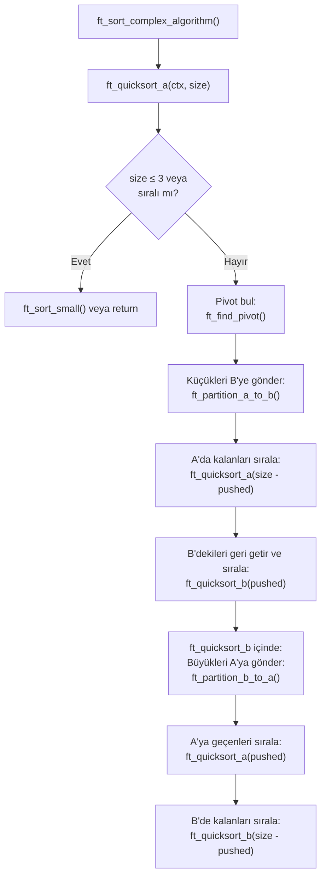
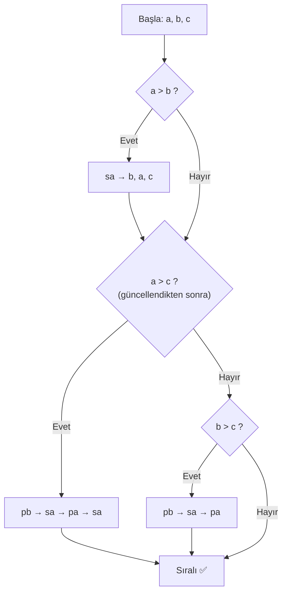
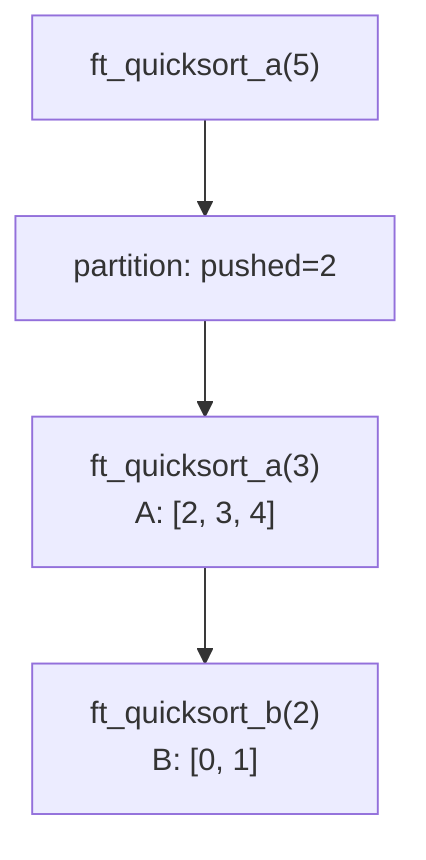
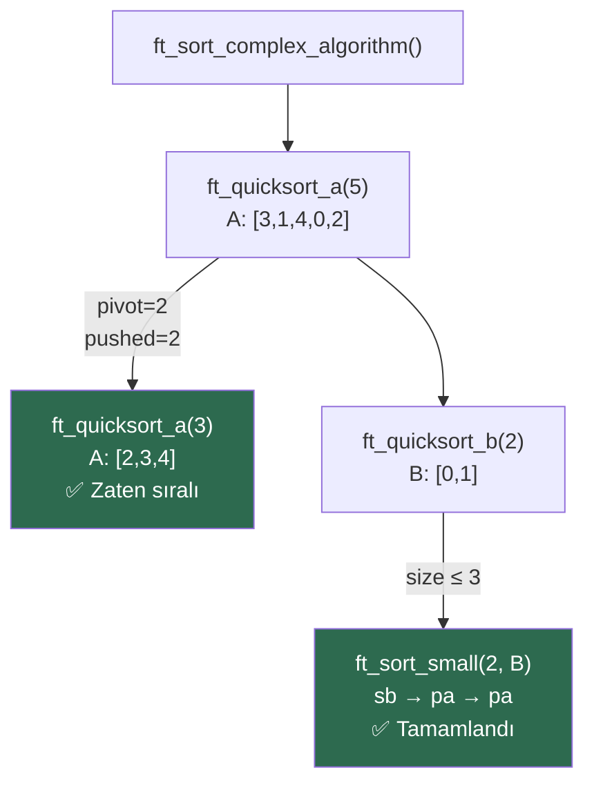

# Push_Swap Quick Sort Algoritması — Detaylı Açıklama

## İçindekiler

1. [Genel Bakış](#genel-bakış)
2. [Veri Yapıları](#veri-yapıları)
3. [Yardımcı Fonksiyonlar (Utils)](#yardımcı-fonksiyonlar-utils)
4. [Ana Algoritma Fonksiyonları](#ana-algoritma-fonksiyonları)
5. [Algoritma Akışı — Görsel Örnek](#algoritma-akışı--görsel-örnek)
6. [Özet](#özet)

---

## Genel Bakış

Bu proje, klasik **Quick Sort** algoritmasını iki stack (`a` ve `b`) üzerinde, yalnızca sınırlı stack operasyonları (`sa`, `sb`, `pa`, `pb`, `ra`, `rb`, `rra`, `rrb` ...) kullanarak uygular. Standart Quick Sort'tan temel farkı şudur:

> [!IMPORTANT]
> Klasik Quick Sort, bir diziyi **yerinde (in-place)** böler. Ancak push_swap'te diziye rastgele erişim yoktur — sadece stack'in **tepesini** görebilir ve operasyonlar uygulayabiliriz. Bu yüzden **partition (bölme)** işlemi elemanları **diğer stack'e push'layarak** yapılır.

### Algoritmanın Üst Düzey Akışı



---

## Veri Yapıları

Algoritmayı anlamak için önce kullanılan yapıları bilmek gerekir:

### `t_list` (Linked List Node)

```c
typedef struct s_list
{
    int             content;  // Orijinal sayı değeri
    int             index;    // Normalize edilmiş sıra (0'dan başlar)
    struct s_list   *next;
} t_list;
```

> [!NOTE]
> `index` alanı çok önemlidir. Sayılar parse edildikten sonra, her elemana sıralamadaki pozisyonuna göre bir **index** atanır. Örneğin `[42, -5, 100, 7]` → index'ler: `[2, 0, 3, 1]`. Tüm karşılaştırmalar bu `index` üzerinden yapılır.

### `t_context` (Program Bağlamı)

```c
typedef struct s_context
{
    float       disorder;   // Karışıklık oranı
    int         bench;      // Benchmark modu
    t_strategy  strategy;   // Hangi algoritma kullanılacak
    t_list      *a;         // Stack A (ana stack)
    t_list      *b;         // Stack B (yardımcı stack)
    int         print_ops;  // Operasyonları yazdır mı?
    int         sa, sb, ss; // Operasyon sayaçları
    int         pa, pb;
    int         ra, rb, rr;
    int         rra, rrb, rrr;
} t_context;
```

---

## Yardımcı Fonksiyonlar (Utils)

Kaynak: [ft_sort_complex_utils.c](file:///Users/akin/Projects/42cursus/push_swap/ft_sort_complex_utils.c)

### 1. `ft_is_sorted_chunk()` — Chunk Sıralı mı?

```c
int ft_is_sorted_chunk(t_list *stack, int size, int is_a);
```

**Amaç:** Stack'in ilk `size` elemanının sıralı olup olmadığını kontrol eder.

**Parametreler:**
| Parametre | Açıklama |
|-----------|----------|
| `stack` | Kontrol edilecek stack'in başı |
| `size` | Kaç eleman kontrol edilecek |
| `is_a` | `1` ise artan sıra kontrol edilir (Stack A), `0` ise azalan sıra (Stack B) |

**Nasıl Çalışır:**
- Stack üzerinde `size - 1` adım atar, her adımda ardışık iki elemanı karşılaştırır.
- **Stack A** için: `index[i] > index[i+1]` → sıralı **değil** (artan sıra bekleniyor)
- **Stack B** için: `index[i] < index[i+1]` → sıralı **değil** (azalan sıra bekleniyor — çünkü B'den A'ya push'landığında ters dönecek)

**Örnek:**
```
Stack A: [1, 3, 5, 7]  → is_a=1 → artan sıralı ✅ return 1
Stack B: [7, 5, 3, 1]  → is_a=0 → azalan sıralı ✅ return 1
Stack A: [1, 5, 3, 7]  → is_a=1 → sıralı değil  ❌ return 0
```

---

### 2. `ft_find_pivot()` — Pivot Değeri Hesapla

```c
int ft_find_pivot(t_list *stack, int size);
```

**Amaç:** Verilen chunk için **medyan tabanlı pivot** değerini hesaplar.

**Algoritma:**
1. Chunk'ın ilk `size` elemanı içinden **minimum index değerini** bulur.
2. `pivot = min + (size / 2)` formülüyle pivot döndürür.

**Neden Bu Formül?**
- Index'ler normalize edilmiş ardışık sayılar olduğu için, `min + size/2` yaklaşık olarak **medyana** karşılık gelir.
- Bu, chunk'ı kabaca yarı yarıya böler → Quick Sort'un **O(n log n)** performansını garanti eder.

**Örnek:**
```
Chunk index'leri: [5, 2, 7, 3, 6]   (size = 5)
min = 2
pivot = 2 + (5 / 2) = 2 + 2 = 4

→ pivot'tan küçükler: [2, 3]    (B'ye gidecek)
→ pivot'tan büyükler: [5, 7, 6] (A'da kalacak)
```

---

### 3. `ft_sort_small()` — Küçük Chunk Sıralama (Dispatcher)

```c
void ft_sort_small(t_context **ctx, int size, int is_a);
```

**Amaç:** 1, 2 veya 3 elemanlı küçük chunk'ları özel algoritmalarla sıralar. Quick Sort'un **base case**'idir.

**Davranış Tablosu:**

| `is_a` | `size` | Eylem |
|--------|--------|-------|
| 1 (A) | 2 | İlk eleman büyükse → `sa` |
| 1 (A) | 3 | `ft_sort_three_a()` çağır |
| 0 (B) | 1 | `pa` (tek elemanı A'ya gönder) |
| 0 (B) | 2 | Gerekirse `sb`, sonra `pa, pa` |
| 0 (B) | 3 | `ft_sort_three_b()` çağır |

---

### 4. `ft_sort_three_a()` — Stack A'da 3 Eleman Sırala

```c
static void ft_sort_three_a(t_context **ctx);
```

**Amaç:** Stack A'nın tepesindeki 3 elemanı artan sıraya sokar.

**Algoritma Akışı:**



**Tüm Durumlar:**

| Başlangıç | Adımlar | Sonuç |
|-----------|---------|-------|
| `1, 2, 3` | (zaten sıralı) | `1, 2, 3` |
| `1, 3, 2` | `pb → sa → pa` | `1, 2, 3` |
| `2, 1, 3` | `sa` | `1, 2, 3` |
| `2, 3, 1` | `pb → sa → pa → sa` | `1, 2, 3` |
| `3, 1, 2` | `sa` → `1, 3, 2` → `pb → sa → pa` | `1, 2, 3` |
| `3, 2, 1` | `sa` → `2, 3, 1` → `pb → sa → pa → sa` | `1, 2, 3` |

---

### 5. `ft_sort_three_b()` — Stack B'de 3 Eleman Sırala

```c
static void ft_sort_three_b(t_context **ctx);
```

**Amaç:** Stack B'nin tepesindeki 3 elemanı **azalan sıraya** sokar, ardından hepsini `pa` ile A'ya gönderir (böylece A'da artan sırada olurlar).

**Mantık:** `ft_sort_three_a`'nın simetriğidir — karşılaştırmalar ters yöndedir (`<` yerine `>`).

---

## Ana Algoritma Fonksiyonları

Kaynak: [ft_sort_complex_algorithm.c](file:///Users/akin/Projects/42cursus/push_swap/ft_sort_complex_algorithm.c)

### 1. `ft_sort_complex_algorithm()` — Giriş Noktası

```c
void ft_sort_complex_algorithm(t_context **ctx)
{
    ft_quicksort_a(ctx, ft_lstsize((*ctx)->a));
}
```

**Amaç:** Tüm Quick Sort sürecini başlatan tek satırlık giriş fonksiyonu. Stack A'nın tamamını sıralamak için `ft_quicksort_a`'yı çağırır.

---

### 2. `ft_quicksort_a()` — Stack A'yı Sırala (Rekürsif)

```c
void ft_quicksort_a(t_context **ctx, int size);
```

**Amaç:** Stack A'nın tepesindeki `size` elemanı artan sıraya sokar.

**Algoritma:**

```
1. Zaten sıralıysa → return (base case 1)
2. size ≤ 3 ise → ft_sort_small() (base case 2)
3. Pivot hesapla
4. Pivot'tan küçükleri B'ye gönder (partition)
5. A'da kalanları rekürsif sırala → ft_quicksort_a(size - pushed)
6. B'ye gönderilenleri geri getir ve sırala → ft_quicksort_b(pushed)
```

> [!TIP]
> **Adım 5 neden 6'dan önce?** Çünkü A'da kalan elemanlar zaten A'nın tepesindedir ve pivot'tan büyüktür. Bunları önce sıralarsak, sonra B'den gelen küçük elemanlar A'nın tepesine gelir ve doğru sırada yerleşir.

---

### 3. `ft_quicksort_b()` — Stack B'yi Sırala (Rekürsif)

```c
void ft_quicksort_b(t_context **ctx, int size);
```

**Amaç:** Stack B'nin tepesindeki `size` elemanı sıralar ve hepsini Stack A'ya gönderir.

**Algoritma:**

```
1. Zaten azalan sıralıysa → hepsini pa ile A'ya gönder (base case 1)
2. size ≤ 3 ise → ft_sort_small() (base case 2)
3. Pivot hesapla
4. Pivot'tan büyükleri (veya eşitleri) A'ya gönder (partition)
5. A'ya gönderilenleri sırala → ft_quicksort_a(pushed)
6. B'de kalanları sırala → ft_quicksort_b(size - pushed)
```

> [!NOTE]
> `ft_quicksort_b` ile `ft_quicksort_a` arasındaki fark: B'deki elemanlar zaten "küçük" gruba aittir, bu yüzden B → A partitioning'de **büyük olanlar** seçilir (`>=` pivot). Bu sayede iki fonksiyon birbirini karşılıklı çağırarak, ping-pong şeklinde tüm elemanları sıralar.

---

### 4. `ft_partition_a_to_b()` — A'dan B'ye Bölme

```c
int ft_partition_a_to_b(t_context **ctx, int size, int pivot);
```

**Amaç:** Stack A'nın tepesindeki `size` eleman içinden, index'i `pivot`'tan **küçük** olanları Stack B'ye push'lar.

**Parametreler ve Dönüş:**
| | Açıklama |
|--|---------|
| `size` | İşlenecek eleman sayısı |
| `pivot` | Bölme eşiği |
| **return** | B'ye push'lanan eleman sayısı (`pushed`) |

**Detaylı Akış:**

```
target = size / 2   (en fazla bu kadar eleman B'ye gidecek)

Her eleman için (tepeden başlayarak):
   ├── index < pivot → pb (B'ye gönder, pushed++)
   └── index >= pivot → ra (A'nın altına gönder, rotated++)

Eğer chunk, A'nın tamamı DEĞİLSE:
   → rotate edilen elemanları geri getir (rra × rotated)
```

> [!WARNING]
> `is_whole` kontrolü kritiktir! Eğer chunk A'nın tamamını kaplıyorsa, rotate edilen elemanlar zaten doğru yerde döngüsel olarak kalır — geri `rra` yapmaya gerek yoktur. Ama chunk A'nın sadece bir kısmıysa, rotate edilen elemanlar alt chunk'ları bozar, bu yüzden geri getirilmeleri gerekir.

**Görsel:**

```
Partition ÖNCE:                    Partition SONRA:
                                   
  Stack A        Stack B             Stack A        Stack B
 ─────────      ─────────           ─────────      ─────────
 │   5   │      │       │           │   5   │      │   2   │
 │   2   │      │       │    →→→    │   7   │      │   3   │
 │   7   │      │       │           │   6   │      │       │
 │   3   │      │       │           │       │      │       │
 │   6   │      │       │           │       │      │       │
 ─────────      ─────────           ─────────      ─────────
 
 size=5, pivot=4 (min=2, 2+5/2=4)
 target=2 (5/2)
 
 index < 4 → pb: {2, 3} → pushed = 2
 index >= 4 → ra: {5, 7, 6} → A'da kalır
```

---

### 5. `ft_partition_b_to_a()` — B'den A'ya Bölme

```c
static int ft_partition_b_to_a(t_context **ctx, int size, int pivot);
```

**Amaç:** Stack B'nin tepesindeki `size` eleman içinden, index'i `pivot`'tan **büyük veya eşit** olanları Stack A'ya push'lar.

**Farklar (A→B partition'a göre):**

| Özellik | A→B | B→A |
|---------|-----|-----|
| Koşul | `index < pivot` → pb | `index >= pivot` → pa |
| Target | `size / 2` | `size - (size / 2)` |
| Rotate | `ra` / `rra` | `rb` / `rrb` |

> [!NOTE]
> B→A'da target `size - (size / 2)` olarak hesaplanır. Bu, A→B'deki `size / 2`'nin tamamlayıcısıdır. Böylece toplam partition dengelidir.

---

## Algoritma Akışı — Görsel Örnek

Şimdi tüm algoritmanın `[3, 1, 4, 0, 2]` girişi için adım adım nasıl çalıştığını görelim.

> [!NOTE]
> Bu örnekte `index` değerleri kullanılır. `[3, 1, 4, 0, 2]` sayıları zaten `0-4` arasında index'lenmiş gibi düşünülebilir (orijinal değerler = index değerleri).

### Başlangıç Durumu

```
  Stack A        Stack B
 ─────────      ─────────
 │   3   │      │       │
 │   1   │      │       │
 │   4   │      │       │
 │   0   │      │       │
 │   2   │      │       │
 ─────────      ─────────
```

---

### Adım 1: `ft_quicksort_a(ctx, 5)`

- Sıralı mı? `[3,1,4,0,2]` → **Hayır**
- `size = 5 > 3` → partition gerekli
- `pivot = ft_find_pivot([3,1,4,0,2], 5)` → min=0, pivot = 0 + 5/2 = **2**
- `ft_partition_a_to_b(ctx, 5, 2)` çağrılır
  - `target = 5/2 = 2`
  - `is_whole = true` (5 == stack A size)

**Partition A→B adımları (pivot = 2, target = 2):**

````carousel
**İterasyon 1:** Tepe = 3, `3 < 2?` → Hayır → `ra`
```
  Stack A        Stack B
 ─────────      ─────────
 │   1   │      │       │
 │   4   │      │       │
 │   0   │      │       │
 │   2   │      │       │
 │   3   │      │       │
 ─────────      ─────────
 pushed=0, rotated=1
```
<!-- slide -->
**İterasyon 2:** Tepe = 1, `1 < 2?` → Evet → `pb`
```
  Stack A        Stack B
 ─────────      ─────────
 │   4   │      │   1   │
 │   0   │      │       │
 │   2   │      │       │
 │   3   │      │       │
 ─────────      ─────────
 pushed=1, rotated=1
```
<!-- slide -->
**İterasyon 3:** Tepe = 4, `4 < 2?` → Hayır → `ra`
```
  Stack A        Stack B
 ─────────      ─────────
 │   0   │      │   1   │
 │   2   │      │       │
 │   3   │      │       │
 │   4   │      │       │
 ─────────      ─────────
 pushed=1, rotated=2
```
<!-- slide -->
**İterasyon 4:** Tepe = 0, `0 < 2?` → Evet → `pb`
```
  Stack A        Stack B
 ─────────      ─────────
 │   2   │      │   0   │
 │   3   │      │   1   │
 │   4   │      │       │
 ─────────      ─────────
 pushed=2 = target → DUR
```
<!-- slide -->
**Geri alma:** `is_whole = true` → rra yapılmaz!

**Partition sonucu:** pushed = 2

```
  Stack A        Stack B
 ─────────      ─────────
 │   2   │      │   0   │
 │   3   │      │   1   │
 │   4   │      │       │
 ─────────      ─────────
```
````

Şimdi rekürsif çağrılar yapılır:



---

### Adım 2: `ft_quicksort_a(ctx, 3)` — A'nın tepesindeki 3 eleman: `[2, 3, 4]`

- Sıralı mı? `2 < 3 < 4` → **Evet!** → `return`
- Hiçbir işlem yapılmaz.

```
  Stack A        Stack B       (değişmedi)
 ─────────      ─────────
 │   2   │      │   0   │
 │   3   │      │   1   │
 │   4   │      │       │
 ─────────      ─────────
```

---

### Adım 3: `ft_quicksort_b(ctx, 2)` — B'nin tepesindeki 2 eleman: `[0, 1]`

- Azalan sıralı mı? `0 < 1` → azalan değil → **Hayır**
- `size = 2 ≤ 3` → `ft_sort_small(ctx, 2, 0)` çağrılır
  - `is_a = 0`, `size = 2`
  - `B[0]=0 < B[1]=1` → `sb` yap, sonra `pa, pa`

**Adım adım:**

````carousel
**sb:** B'nin ilk iki elemanını swap et
```
  Stack A        Stack B
 ─────────      ─────────
 │   2   │      │   1   │
 │   3   │      │   0   │
 │   4   │      │       │
 ─────────      ─────────
```
<!-- slide -->
**pa:** B'nin tepesini A'ya gönder
```
  Stack A        Stack B
 ─────────      ─────────
 │   1   │      │   0   │
 │   2   │      │       │
 │   3   │      │       │
 │   4   │      │       │
 ─────────      ─────────
```
<!-- slide -->
**pa:** B'nin tepesini A'ya gönder
```
  Stack A        Stack B
 ─────────      ─────────
 │   0   │      │       │
 │   1   │      │       │
 │   2   │      │       │
 │   3   │      │       │
 │   4   │      │       │
 ─────────      ─────────
```
````

---

### ✅ Sonuç

```
  Stack A (Sıralı!)    Stack B (Boş)
 ─────────────────    ─────────
 │       0       │    │       │
 │       1       │    │       │
 │       2       │    │       │
 │       3       │    │       │
 │       4       │    │       │
 ─────────────────    ─────────
```

**Toplam operasyonlar:** `ra, pb, ra, pb, sb, pa, pa` = **7 operasyon**

---

### Tüm Rekürsif Çağrı Ağacı



---

## Özet

### Fonksiyon Haritası

| Fonksiyon | Dosya | Rol |
|-----------|-------|-----|
| [`ft_sort_complex_algorithm`](file:///Users/akin/Projects/42cursus/push_swap/ft_sort_complex_algorithm.c#L107-L110) | algorithm.c | Giriş noktası |
| [`ft_quicksort_a`](file:///Users/akin/Projects/42cursus/push_swap/ft_sort_complex_algorithm.c#L67-L83) | algorithm.c | A stack'inde rekürsif Quick Sort |
| [`ft_quicksort_b`](file:///Users/akin/Projects/42cursus/push_swap/ft_sort_complex_algorithm.c#L85-L105) | algorithm.c | B stack'inde rekürsif Quick Sort |
| [`ft_partition_a_to_b`](file:///Users/akin/Projects/42cursus/push_swap/ft_sort_complex_algorithm.c#L15-L39) | algorithm.c | A'dan B'ye partition (küçükleri gönder) |
| [`ft_partition_b_to_a`](file:///Users/akin/Projects/42cursus/push_swap/ft_sort_complex_algorithm.c#L41-L65) | algorithm.c | B'den A'ya partition (büyükleri gönder) |
| [`ft_is_sorted_chunk`](file:///Users/akin/Projects/42cursus/push_swap/ft_sort_complex_utils.c#L15-L26) | utils.c | Chunk sıralı mı kontrol et |
| [`ft_find_pivot`](file:///Users/akin/Projects/42cursus/push_swap/ft_sort_complex_utils.c#L28-L43) | utils.c | Medyan tabanlı pivot hesapla |
| [`ft_sort_small`](file:///Users/akin/Projects/42cursus/push_swap/ft_sort_complex_utils.c#L96-L119) | utils.c | 1-3 elemanlı base case sıralama |
| [`ft_sort_three_a`](file:///Users/akin/Projects/42cursus/push_swap/ft_sort_complex_utils.c#L45-L67) | utils.c | A'da 3 eleman sırala |
| [`ft_sort_three_b`](file:///Users/akin/Projects/42cursus/push_swap/ft_sort_complex_utils.c#L69-L94) | utils.c | B'de 3 eleman sırala ve A'ya gönder |

### Algoritmanın Temel Prensipleri

1. **Böl ve Yönet:** Her adımda chunk'ı pivot etrafında ikiye böler
2. **İki Stack Ping-Pong:** Küçükler B'ye, büyükler A'ya — karşılıklı rekürsif çağrılarla sıralama
3. **Medyan Pivot:** `min + size/2` formülü dengeli bölme sağlar
4. **Base Case:** 3 veya daha az eleman doğrudan sıralanır
5. **Early Exit:** Zaten sıralı chunk'lar atlanır → gereksiz operasyon önlenir
6. **Rotate Geri Alma:** Partial chunk'larda rotate edilen elemanlar geri getirilir → diğer chunk'lar bozulmaz
